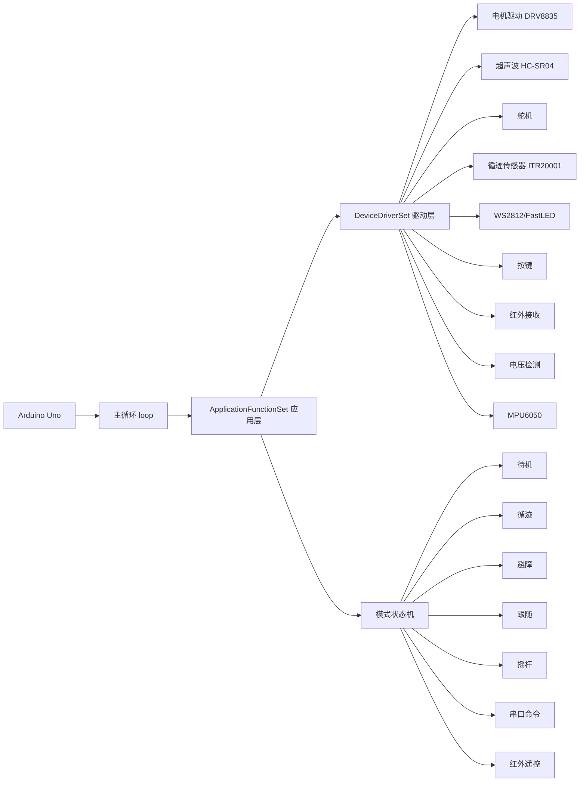
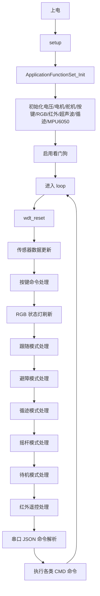
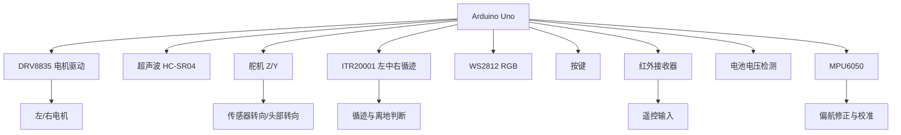

# WALL-E 原始项目说明（基于 lib/srcv4 源码）

## 1. 文档说明

这份文档对应仓库中的原始参考项目代码：`lib/srcv4/`。

这套代码本质上是 **ELEGOO Smart Robot Car V4.0** 的一套较完整控制程序，采用的是：

- `Arduino UNO` 单片机主控
- 大 `loop()` + 多模式状态机
- 应用层 `ApplicationFunctionSet`
- 驱动层 `DeviceDriverSet`

它和当前仓库里新的 `src/main.cpp` 不是同一套架构。

---

## 2. 原始项目入口与核心文件

原始项目的主入口在：

- `lib/srcv4/SmartRobotCarV4.0_V0_20210120.ino`

核心源码主要包括：

- `lib/srcv4/ApplicationFunctionSet_xxx0.h`
- `lib/srcv4/ApplicationFunctionSet_xxx0.cpp`
- `lib/srcv4/DeviceDriverSet_xxx0.h`
- `lib/srcv4/DeviceDriverSet_xxx0.cpp`
- `lib/srcv4/MPU6050_getdata.*`
- `lib/srcv4/IRremote.*`
- `lib/srcv4/PinChangeInt.h`

从结构上看，原始项目是典型的：

> **主循环调应用层、应用层调驱动层、驱动层直接操作硬件。**

---

## 3. 原始项目做了什么

原始项目不是一个单一“避障程序”，而是一套**多功能智能小车系统**。它包含：

- 循迹模式
- 避障模式
- 跟随模式
- 摇杆/方向控制模式
- 红外遥控模式
- 串口 JSON 命令控制模式
- 灯光控制模式
- 舵机控制模式
- 低电压检测与灯光提醒
- 小车离地检测
- MPU6050 偏航修正/标定辅助

所以原始版本更接近一个“功能完整的产品原型”，而不是单一实验程序。

---

## 4. 原始项目总体框图

---

## 5. 原始项目运行流程图

---

## 6. 原始项目的软件架构

## 6.1 两层结构

原始项目的代码分成两层：

### 第一层：应用层 `ApplicationFunctionSet`

负责：

- 模式切换
- 传感器状态整合
- 高层运动决策
- 串口命令解释
- 红外/按键事件转模式

### 第二层：驱动层 `DeviceDriverSet`

负责：

- 直接访问硬件引脚
- 读写传感器
- 控制电机、舵机、灯光、红外等设备

这种结构虽然没有现代任务调度器，但在 Arduino 传统项目里是比较常见的工程化写法。

---

## 6.2 状态机结构

原始项目定义了两类关键枚举：

- 运动控制方向 `SmartRobotCarMotionControl`
- 功能模式 `SmartRobotCarFunctionalModel`

功能模式主要包括：

- `Standby_mode`：待机
- `TraceBased_mode`：循迹
- `ObstacleAvoidance_mode`：避障
- `Follow_mode`：跟随
- `Rocker_mode`：摇杆控制
- `CMD_Programming_mode`：编程/命令等待
- `CMD_MotorControl`：电机控制
- `CMD_CarControl_TimeLimit`：定时车体控制
- `CMD_CarControl_NoTimeLimit`：持续车体控制
- `CMD_MotorControl_Speed`：左右轮速度控制
- `CMD_ServoControl`：舵机控制
- `CMD_LightingControl_TimeLimit/NoTimeLimit`：灯光控制

这说明原始项目本质上是一个：

> **围绕 Functional_Mode 运转的多模式状态机系统。**

---

## 7. 原始项目主循环是怎么工作的

原始项目的 `loop()` 中依次调用很多应用层函数，每一轮都扫一遍：

1. 重置看门狗
2. 更新传感器状态
3. 读取按键，决定是否切模式
4. 刷新 RGB 状态灯
5. 如果当前是“跟随模式”，执行跟随逻辑
6. 如果当前是“避障模式”，执行避障逻辑
7. 如果当前是“循迹模式”，执行循迹逻辑
8. 如果当前是“摇杆模式”，执行方向控制
9. 如果当前是“待机模式”，执行停车与 MPU 校准
10. 处理红外遥控输入
11. 解析串口 JSON 命令
12. 执行各类命令模式逻辑

也就是说，它不是通过任务调度器来控制频率，而是通过：

- 不断循环
- 在每个函数内部判断 `Functional_Mode`
- 决定当前这轮是否执行

这是一种典型的 Arduino 早期状态机架构。

---

## 8. 原始项目的核心模块讲解

## 8.1 传感器数据更新：`ApplicationFunctionSet_SensorDataUpdate()`

这个函数负责维护基础传感器状态。

当前能明确看到的更新内容包括：

- **电压检测**
  - 周期性读取电池电压
  - 低于阈值 `7.00V` 持续多次后判定低电压

- **循迹传感器状态**
  - 读取左/中/右三个 ITR20001 模拟量
  - 判断是否命中黑线阈值区间

- **离地检测**
  - 如果左中右循迹值都高于离地阈值，则认为车离开地面
  - 离地时很多运动模式会强制停车

这一步相当于整个状态机的“底层数据刷新器”。

---

## 8.2 运动控制核心：`ApplicationFunctionSet_SmartRobotCarMotionControl()`

原始项目真正的运动控制核心不是模式函数本身，而是这个统一运动控制函数。

它负责把“前进 / 后退 / 左转 / 右转”等抽象指令，转换成左右电机的输出。

更关键的是，它对某些模式下的前进/后退加入了：

- **MPU6050 偏航修正**
- 比例控制 `Kp`
- 左右轮动态速度补偿

也就是说，原始项目并不是简单让两个轮子同速跑，而是希望在：

- 摇杆模式
- 避障模式
- 跟随模式
- 命令控制模式

这些场景里，利用姿态数据减少跑偏。

这一点其实很重要，因为它说明：

> 原始项目已经包含“闭环方向修正”的雏形，而不是纯开环驱动。

---

## 8.3 循迹模式：`ApplicationFunctionSet_Tracking()`

原始项目的循迹逻辑基于左/中/右三个红外循迹传感器。

基本规则如下：

- 中间传感器命中黑线：前进
- 右侧传感器命中：右转修正
- 左侧传感器命中：左转修正

更特别的是，它还实现了一个 **Blind Detection（盲搜）** 逻辑：

- 当三路都没检测到黑线时，先记录时间戳
- 短时间内尝试右摆、左摆搜索轨迹
- 如果持续一段时间仍然丢线，则停车

所以原始项目的循迹不是最简单的三分支判断，而是带了“丢线恢复策略”。

---

## 8.4 避障模式：`ApplicationFunctionSet_Obstacle()`

原始项目的避障逻辑比当前新版本更成熟。

逻辑大致为：

1. 舵机先归中（90°）
2. 测前方距离
3. 若前方 `0~20cm` 内有障碍：
   - 停车
   - 控制舵机依次扫多个方向（约 30°、90°、150°）
   - 每个方向重新测距
   - 如果某个方向畅通，就向对应方向转向
   - 如果所有方向都近，则先后退再右转
4. 若前方无障碍，则继续前进

所以原始项目的避障本质上是：

> **“测前方 → 扫左右 → 选可通方向 → 转向” 的多方向避障逻辑。**

这明显强于当前新版本“仅根据最新距离做速度/转向”的单点策略。

---

## 8.5 跟随模式：`ApplicationFunctionSet_Follow()`

“跟随模式”在原始项目里也依赖超声波和舵机，但目标不是避障，而是寻找目标方位。

简化理解如下：

- 如果前方近距离范围内检测到目标，就朝当前舵机指向的方向前进/转向
- 如果前方没有检测到，就停车并周期性改变舵机方向
- 舵机在多个角度之间停留，尝试重新捕获目标
- 一旦目标重新进入检测范围，再根据当前角度决定前进/左转/右转

所以它更像一种：

> **基于超声波距离阈值的简化目标搜索/跟随逻辑。**

---

## 8.6 摇杆模式：`ApplicationFunctionSet_Rocker()`

摇杆模式本身很简单：

- 如果当前模式是 `Rocker_mode`
- 就直接执行 `Motion_Control` 指定的方向
- 速度由 `Rocker_CarSpeed` 决定

这个模式通常不是独立自己生成方向，而是由：

- 红外遥控
- 串口命令
- 上位机/APP

给它写入方向和速度。

---

## 8.7 待机模式：`ApplicationFunctionSet_Standby()`

待机模式不只是停车。

它会：

- 停止电机
- 在确认小车稳定放置在地面上后
- 触发一次 MPU6050 校准

这说明原始项目把待机模式也当作一个“静态重置与标定状态”。

---

## 8.8 RGB 灯光状态：`ApplicationFunctionSet_RGB()`

原始项目的 RGB 灯承担的是**状态指示器**角色，不是简单的距离渐变灯。

它会根据不同模式显示不同颜色/效果，比如：

- 低电压：红灯闪烁提醒
- 待机：呼吸式灯效
- 循迹：绿色
- 避障：黄色
- 其他模式：对应颜色或效果

因此它更像一个“系统状态面板”。

---

## 8.9 按键模式切换：`ApplicationFunctionSet_KeyCommand()`

原始项目支持一个本地按键进行模式轮换/切换。

根据代码可确认：

- 按键值 1：进入循迹模式
- 按键值 2：进入避障模式
- 按键值 3：进入跟随模式
- 按键值 4：进入待机模式

这意味着原始项目即使不接 APP，也能通过实体按键切换主要功能。

---

## 8.10 红外遥控：`ApplicationFunctionSet_IRrecv()`

原始项目还支持红外遥控器。

红外输入可用于：

- 前进/后退/左转/右转
- 切换待机 / 循迹 / 避障 / 跟随
- 调整循迹阈值
- 调整各模式速度

其中方向控制会临时切到 `Rocker_mode`，超过一定时间未收到新的方向按键，就自动回到待机。

所以红外遥控不只是“简单开车”，而是一个完整的人机输入接口。

---

## 8.11 串口 JSON 命令控制：`ApplicationFunctionSet_SerialPortDataAnalysis()`

原始项目支持串口接收 JSON 数据帧，然后切换到不同 `CMD_*` 模式执行命令。

从源码可确认支持的主要命令类型包括：

- `N=1`：电机控制
- `N=2`：小车方向控制（带时间）
- `N=3`：小车方向控制（不带时间）
- `N=4`：左右电机速度控制
- `N=5`：舵机控制
- `N=7/8`：灯光控制
- `N=21`：超声波状态/数据查询
- `N=22`：循迹模块数据查询
- `N=100/110`：清除功能并进入待机或编程模式
- `N=101`：模式切换
- `N=102`：摇杆控制
- `N=105`：LED 亮度调节
- `N=106`：舵机方向调整

这说明原始项目已经具备：

> **本地自主模式 + 遥控模式 + 串口上位机控制模式**

三种控制形态。

---

## 9. 原始项目的硬件驱动层

驱动层 `DeviceDriverSet` 中包含的设备驱动主要有：

- `DeviceDriverSet_RBGLED`
- `DeviceDriverSet_Key`
- `DeviceDriverSet_ITR20001`
- `DeviceDriverSet_Voltage`
- `DeviceDriverSet_Motor`
- `DeviceDriverSet_ULTRASONIC`
- `DeviceDriverSet_Servo`
- `DeviceDriverSet_IRrecv`

再加上应用层里直接使用的：

- `MPU6050_getdata`

因此原始项目是一个硬件覆盖面很完整的机器人底盘工程。

---

## 10. 原始项目的硬件框图

---

## 11. 原始项目的一个关键特点：修改了定时器

`Description.txt` 和驱动代码都明确提到：

- 为了适配电机驱动 PWM 输出频率
- 原始项目修改了 `T0` 定时器配置
- 因此标准 `delay()` / `millis()` 会受影响
- 项目里额外封装了 `_delay()` / `_millis()` 进行补偿

这是原始项目非常重要的一个工程细节。

也就是说，这套代码不是“随便复制就能平滑迁移”的，因为它对底层时基做过改动。

---

## 12. 原始项目的优点与局限

### 优点

- 功能覆盖很完整
- 支持多种交互方式：按键、红外、串口命令
- 有模式状态机，产品化程度较高
- 已经使用 MPU6050 参与运动修正
- 有离地检测、低电压检测等保护逻辑

### 局限

- 主循环很大，逻辑耦合较强
- 很多功能都堆在 `ApplicationFunctionSet_xxx0.cpp` 中，维护成本高
- 不是任务调度式架构，扩展新模块不够优雅
- 与具体硬件绑定较深
- 某些逻辑依赖时序、阻塞和定时器补偿，迁移难度较高

---

## 13. 如何定位这套原始代码

最准确的定位是：

> **一套基于 Arduino UNO 的多模式智能车完整控制框架。**

它已经不是简单样例，而是一套：

- 可切换功能模式
- 可本地遥控
- 可串口上位机控制
- 可做基本自主行为

的完整底层系统。

---

## 14. 总结

如果只看“功能成熟度”，原始项目明显比当前新架构版本更完整；
但如果只看“代码结构现代化程度”，当前新架构更清晰。

因此原始项目的价值主要在于：

1. 提供成熟功能参考
2. 提供模式状态机设计参考
3. 提供避障/跟随/循迹等逻辑来源
4. 为当前新版本后续迁移提供功能清单
