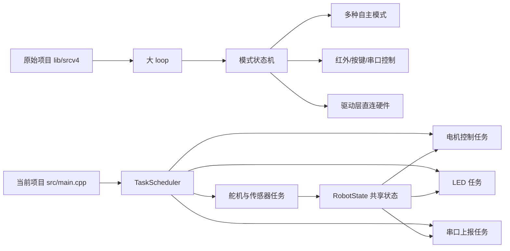
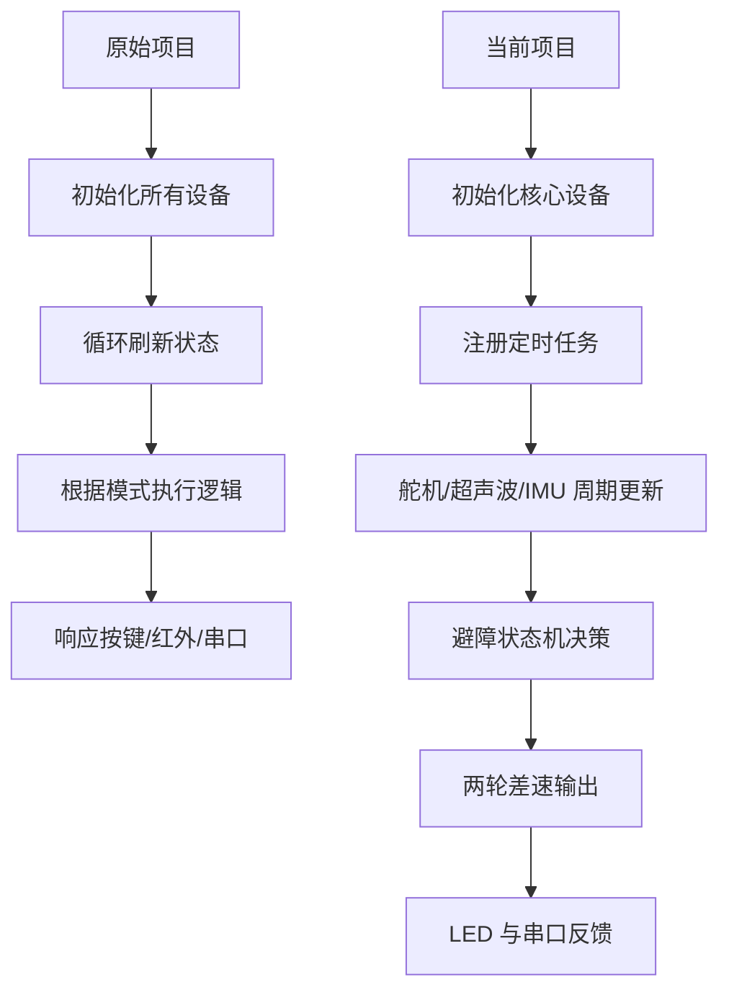

# 当前项目与原始项目对比说明

## 1. 对比说明

这份文档用于对比两套代码：

- **原始项目**：`lib/srcv4/`
- **当前项目**：`src/main.cpp` + `src/esp32_main.cpp`

需要特别说明的是，当前项目已经不再只是“新架构骨架”，而是已经把原始项目中一部分关键能力迁移到了新的任务调度式结构中，尤其包括：

- **多方向避障扫描**
- **两轮差速动作抽象**
- **基于 MPU6050 的偏航修正**
- **更明确的避障状态机**

因此，当前项目与原始项目的关系已经从“功能尚未迁回”演进为：

> **原始项目提供成熟功能来源，当前项目已经在新架构中重建了其中一部分核心自主运动能力。**

---

## 2. 两代项目定位差异

### 原始项目定位

原始项目是一套相对完整的智能车控制程序，强调：

- 多模式功能完整性
- 遥控/串口交互能力
- 现成可用的产品式行为
- 在传统 Arduino 大循环结构中集成多种能力

### 当前项目定位

当前项目是一版**正在持续完善的新架构实现**，强调：

- `TaskScheduler` 驱动的周期任务组织
- 共享状态 `RobotState` 驱动控制
- 面向 Uno 与 ESP32-CAM 分环境构建
- 将旧项目中成熟逻辑按模块迁回，而不是整体照搬大状态机

所以当前项目不是“缩水版”，也不是“空壳版”，而是：

> **已经具备核心自主避障闭环，并继续向完整系统演进的新主线版本。**

---

## 3. 架构对比框图

---

## 4. 核心差异总表

| 对比项 | 原始项目 | 当前项目 |
|---|---|---|
| 主入口 | `lib/srcv4/SmartRobotCarV4.0_V0_20210120.ino` | `src/main.cpp` |
| 程序组织方式 | 大循环 + 模式状态机 | `TaskScheduler` 多任务 |
| 控制核心 | `Functional_Mode` 模式切换 | `RobotState` + 周期任务 |
| 交互方式 | 按键、红外、串口 JSON | 当前主要是自动运行 + 串口日志 |
| 自主功能 | 循迹、避障、跟随、摇杆 | 当前已实现任务式避障主链路 |
| 姿态使用 | 已用于偏航修正/校准 | 已接入偏航积分与直行/倒车修正 |
| 灯光用途 | 模式/状态指示 | 距离风险渐变显示 |
| 超声波策略 | 多模式使用，多方向扫描 | 已实现右-中-左扫描与决策 |
| 电机控制抽象 | 统一运动控制函数 | `MotionCommand` 两轮差速抽象 |
| 摄像头规划 | 无 | 有 `ESP32-CAM` 预留入口 |
| 开发状态 | 功能较完整 | 新架构持续迁移中 |

---

## 5. 流程对比图

---

## 6. 从“状态机”到“任务调度”的变化

这是两代代码最本质的差异。

### 原始项目

原始项目的思路是：

1. 维护一个 `Functional_Mode`
2. 每轮循环把所有模式函数都调用一次
3. 每个函数内部判断当前是不是自己的模式
4. 如果是，就执行；不是，就快速退出

优点是直观，缺点是：

- `loop()` 很重
- 不同功能容易互相耦合
- 不同模块的时间节奏不够清晰
- 迁移和扩展时容易继续堆叠逻辑

### 当前项目

当前项目的思路是：

1. 用 `TaskScheduler` 定义独立周期任务
2. 采集、控制、显示、上报分开执行
3. 用 `RobotState` 作为共享状态中心
4. 用独立枚举描述动作和避障阶段
5. 把复杂避障拆成多个可观察阶段

优点是：

- 结构更清楚
- 扩展更自然
- 调试点更明确
- 更容易继续接入通信、视觉和新传感器

所以当前项目的提升不仅是**架构层**，也开始体现在**核心控制能力已经被重新实现**。

---

## 7. 功能迁移情况对比

## 7.1 已经在当前版本落地的部分

当前版本已经具备：

- 超声波测距
- 舵机定点扫描
- 电机控制
- 距离驱动的速度控制
- 多方向避障决策
- 倒车脱困
- 定时转向动作
- WS2812 实时告警
- 串口日志输出
- MPU6050 陀螺仪零偏校准
- 偏航角积分
- 前进/后退时的偏航修正
- 多环境构建（Uno / ESP32-CAM）

这说明当前项目已经不只是“最小可运行闭环”，而是已经形成了一个更完整的：

> **感知 -> 扫描 -> 决策 -> 运动 -> 姿态修正 -> 反馈**

的基础自主运动闭环。

---

## 7.2 原始项目有、当前还没迁移完整的部分

当前还没有完整迁移的功能，主要包括：

- 循迹模式
- 跟随模式
- 红外遥控
- 本地按键切换模式
- 串口 JSON 指令控制协议
- 低电压告警
- 离地检测
- 更完整的多模式状态灯体系
- ESP32-CAM 与 Uno 的协同控制

所以从功能清单来看，当前版本仍然处在“重构迁移进行中”，但核心底盘控制能力已经明显增强。

---

## 8. 传感器使用方式的变化

### 原始项目

- 超声波：用于避障、跟随、命令查询
- ITR20001：用于循迹与离地检测
- MPU6050：用于校准和运动修正
- 电压采样：用于低电压提醒

### 当前项目

- 超声波：已用于前向检测、右中左扫描和避障决策
- MPU6050：已用于陀螺仪零偏标定、偏航角估计和直行/倒车修正
- WS2812：用于距离风险实时可视化
- ITR20001 / 电压 / 红外 / 按键：当前主程序还未重新接回主链路

这意味着当前项目不是“传感器还没真正用起来”，而是：

> **已经把超声波和 IMU 两个核心传感器重新纳入主控制链路，只是其他外围能力仍待迁移。**

---

## 9. 电机控制思路的变化

### 原始项目

原始项目强调“多模式动作控制”，并加入了：

- 左右轮分配
- 偏航修正
- 方向时间控制
- 摇杆/红外/串口驱动动作

### 当前项目

当前项目已经形成了更清晰的底层动作抽象：

- 使用 `MotionCommand` 表达动作语义
- 统一通过 `applyMotion()` 下发到左右轮
- 把“动作语义”和“电机引脚输出”分离
- 在统一动作层中决定：
  - 左右轮方向
  - 左右轮速度
  - 是否启用偏航修正

这意味着当前版本已经具备明确的**两轮差速动作抽象**，例如：

- `MOTION_FORWARD`
- `MOTION_BACKWARD`
- `MOTION_TURN_LEFT`
- `MOTION_TURN_RIGHT`
- `MOTION_STOP`

这种抽象比“直接在各模式里散写左右轮输出”更利于维护，也更利于后续扩展其他动作策略。

---

## 10. 避障逻辑的变化

### 原始项目

原始项目的避障逻辑本质上是：

1. 测前方
2. 遇障碍后停止
3. 舵机扫描不同方向
4. 根据距离选择转向
5. 必要时后退再转向

这是一个比较成熟的多方向避障逻辑。

### 当前项目

当前项目已经把这类思路重建为显式状态机，包含如下阶段：

- `AVOID_DRIVE_FORWARD`
- `AVOID_SCAN_RIGHT`
- `AVOID_SCAN_CENTER`
- `AVOID_SCAN_LEFT`
- `AVOID_DECIDE`
- `AVOID_REVERSE`
- `AVOID_TURN_LEFT`
- `AVOID_TURN_RIGHT`

它的优点在于：

- 每个阶段职责单一
- 扫描顺序和动作时序更清楚
- 更容易记录日志和调试
- 更适合后续加条件判断、超时保护和更多扫描策略

所以从“避障完整性”来看，当前项目已经不再是简单的“看到近就减速/转一下”，而是已经具备：

> **完整的扫描式避障状态机。**

---

## 11. 姿态控制能力的变化

### 原始项目

原始项目中的 MPU6050 已经用于：

- 校准
- 偏航修正
- 在若干模式下减小跑偏

### 当前项目

当前项目已经把姿态控制能力重新接入主程序，主要包括：

1. **MPU6050 初始化**
2. **陀螺仪 Z 轴零偏标定**
3. **角速度死区抑制**
4. **偏航角积分**
5. **目标航向记录**
6. **比例式偏航修正**

同时，当前项目对修正生效范围做了更明确的边界控制：

- **只在前进和后退时启用偏航修正**
- **原地左转/右转时不启用偏航修正**
- 进入新的直行或倒车动作时重新捕获目标航向

这比“所有动作都统一修正”更合理，因为转向动作本身就是主动改变航向，不应再叠加直行修正逻辑。

因此可以认为，当前项目已经恢复了原始项目中较关键的一项能力：

> **基于 IMU 的闭环方向修正。**

---

## 12. 灯光逻辑的变化

### 原始项目

灯光主要表达的是：

- 当前模式是什么
- 是否低电压
- 当前系统状态如何

### 当前项目

灯光主要表达的是：

- 距离有多危险
- 从红到绿连续变化
- 作为当前主避障链路的实时可视化反馈

这个变化说明两代项目的设计目标不同：

- 原始项目：灯光是“系统状态指示器”
- 当前项目：灯光是“环境风险显示器”

在当前自主运行模式下，这种设计更贴合演示和调试需求。

---

## 13. 为什么说当前项目已经进入“功能迁移中期”

从当前代码结构判断，当前版本已经体现出几个明确特征：

1. 新架构已经稳定成型  
   - 不是临时实验代码  
   - 核心任务边界明确  

2. 原始项目关键能力已开始实质迁移  
   - 多方向避障  
   - 偏航修正  
   - 统一动作抽象  

3. 仍有大量外围能力待迁回  
   - 循迹  
   - 跟随  
   - 遥控  
   - 命令协议  
   - 电源与安全检测  

所以当前版本最准确的描述应该是：

> **新架构底盘已稳定，核心自主运动能力已部分迁移完成，外围能力仍在继续整合。**

---

## 14. 从工程角度怎么看“现在”和“以前”

如果从不同角度评价，会得到不同结论：

### 从功能完整度看

- 原始项目仍然更强

### 从代码结构可维护性看

- 当前项目更好

### 从核心避障实现清晰度看

- 当前项目更清晰

### 从姿态修正重新落地情况看

- 当前项目已经达到“可用基础版”

### 从后续扩展潜力看

- 当前项目更有优势

### 从即插即用程度看

- 原始项目更成熟

因此更合理的结论不是“谁更好”，而是：

> **原始项目更像成熟功能仓库，当前项目更像已经开始承接核心能力的新主线版本。**

---

## 15. 推荐的后续迁移优先级

如果后续要把原始项目的能力继续迁回当前架构，建议优先顺序如下：

1. **安全与输入基础能力**
   - 电压检测
   - 按键输入
   - 红外输入

2. **自主行为补全**
   - 循迹模式
   - 跟随模式
   - 更丰富的避障策略

3. **通信能力迁移**
   - 串口 JSON 协议
   - 与 ESP32-CAM 的联动协议

4. **控制增强**
   - 更稳健的 IMU 漂移抑制
   - 更细致的转向完成判定
   - 更可靠的测距滤波与异常处理

这样做的好处是：

- 不会把旧项目的大状态机整体搬回
- 能持续保持当前项目更清晰的任务式结构
- 可以在每一步迁移后都保持系统可运行、可验证

---

## 16. 总结

一句话总结两代项目现在的关系：

> **原始项目提供成熟功能来源，当前项目已经在新架构下重建了其中的核心避障与姿态控制能力。**

如果继续开发，最理想的方向不是回退到旧代码，而是：

> **把原始项目中成熟的功能逻辑，按模块继续迁移到当前任务调度式的新架构里。**

因此，当前版本虽然还没有达到原始项目那样的“全功能状态”，但它已经不再只是骨架，而是一个：

> **具备扫描避障、两轮差速抽象和基础姿态闭环能力的 WALL-E 新主线控制版本。**