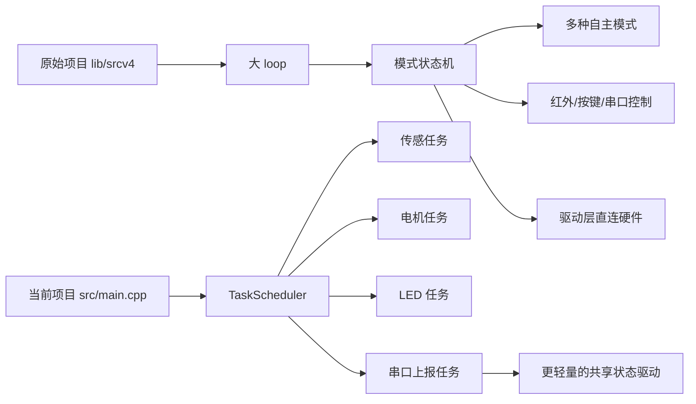
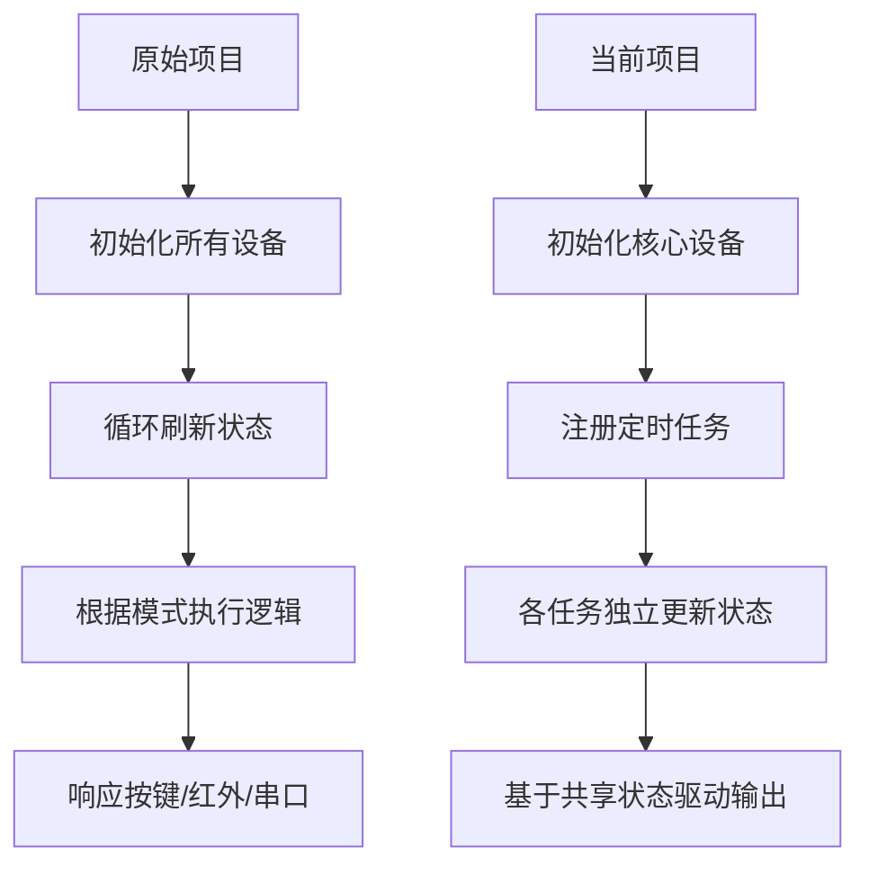

# 当前项目与原始项目对比说明

## 1. 对比说明

这份文档用于对比两套代码：

- **原始项目**：`lib/srcv4/`
- **当前项目**：`src/main.cpp` + `src/esp32_main.cpp`

其中需要特别说明的是：

> **当前项目还在开发中，不能按“功能是否齐全”直接和原始项目做简单高低判断。**

更准确的说法应该是：

- 原始项目：功能成熟、结构传统
- 当前项目：结构更清晰、功能尚在迁移中

---

## 2. 两代项目定位差异

### 原始项目定位

原始项目是一套相对完整的智能车控制程序，强调：

- 多模式功能完整性
- 遥控/串口交互能力
- 现成可用的产品式行为

### 当前项目定位

当前项目更像是一次**重构中的新架构版本**，强调：

- 代码结构简化
- 任务调度式组织
- 数据驱动控制
- 为后续 Uno + ESP32-CAM 协同打基础

所以当前项目不是“缩水版”，而是“尚未迁移完功能的新底座”。

---

## 3. 架构对比框图

---

## 4. 核心差异总表

| 对比项 | 原始项目 | 当前项目 |
|---|---|---|
| 主入口 | `lib/srcv4/SmartRobotCarV4.0_V0_20210120.ino` | `src/main.cpp` |
| 程序组织方式 | 大循环 + 状态机 | `TaskScheduler` 多任务 |
| 控制核心 | `Functional_Mode` 模式切换 | `RobotState` + 周期任务 |
| 交互方式 | 按键、红外、串口 JSON | 当前主要是自动运行 + 串口日志 |
| 自主功能 | 循迹、避障、跟随、摇杆 | 当前仅基础避障/速度控制 |
| 姿态使用 | 已用于偏航修正/校准 | 只读了温度，姿态尚未接入 |
| 灯光用途 | 模式/状态指示 | 距离风险渐变显示 |
| 超声波策略 | 多模式使用，多方向扫描 | 当前主要使用最新距离值 |
| 摄像头规划 | 无 | 有 `ESP32-CAM` 预留入口 |
| 开发状态 | 功能较完整 | 新架构开发中 |

---

## 5. 流程对比图

---

## 6. 从“状态机”到“任务调度”的变化

这是两代代码最本质的差异。

### 原始项目

原始项目的思路是：

1. 维护一个 `Functional_Mode`
2. 每轮循环把所有模式函数都调用一次
3. 每个函数内部判断当前是不是自己的模式
4. 如果是，就执行；不是，就快速退出

优点是直观，缺点是：

- `loop()` 很重
- 不同功能容易互相耦合
- 时间节奏不够清晰

### 当前项目

当前项目的思路是：

1. 用 `TaskScheduler` 定义独立周期任务
2. 采集、控制、显示、上报分开执行
3. 用 `RobotState` 共享数据

优点是：

- 结构更清楚
- 扩展更自然
- 后续加 ESP32-CAM、通信、视觉更方便

所以当前项目的提升主要在**架构层**，而不是现阶段的**功能层**。

---

## 7. 功能迁移情况对比

## 7.1 已经在当前版本落地的部分

当前版本已经具备：

- 超声波测距
- 舵机扫描
- 电机控制
- 距离驱动的避让策略
- WS2812 实时告警
- 串口日志输出
- 多环境构建（Uno / ESP32-CAM）

这说明当前项目已经把“最小可运行闭环”搭起来了。

---

## 7.2 原始项目有、当前还没迁移完整的部分

当前还没有完整迁移的功能，主要包括：

- 循迹模式
- 跟随模式
- 红外遥控
- 本地按键切换模式
- 串口 JSON 指令控制协议
- 低电压告警
- 离地检测
- MPU6050 偏航修正控制
- 更完整的模式状态灯体系

所以从功能清单来看，当前版本确实还在“重构迁移中”。

---

## 8. 传感器使用方式的变化

### 原始项目

- 超声波：用于避障、跟随、命令查询
- ITR20001：用于循迹与离地检测
- MPU6050：用于校准和运动修正
- 电压采样：用于低电压提醒

### 当前项目

- 超声波：主要用于前方距离决策
- MPU6050：当前只使用温度做声速补偿
- ITR20001 / 电压 / 红外 / 按键：当前主程序还未接回主链路

这意味着当前项目不是“传感器不支持”，而是“尚未逐项重接入”。

---

## 9. 电机控制思路的变化

### 原始项目

原始项目更强调“多模式动作控制”，并且加入了：

- 左右轮分配
- 偏航修正
- 方向时间控制
- 摇杆/红外/串口驱动动作

### 当前项目

当前项目更强调“单一闭环”：

- 根据距离直接决定速度和方向
- 不再围绕多个模式切换组织代码
- 先把避障链路跑通

也就是说，当前版本先做的是：

> **把基础闭环做稳，再逐步恢复复杂能力。**

---

## 10. 灯光逻辑的变化

### 原始项目

灯光主要表达的是：

- 当前模式是什么
- 是否低电压
- 当前系统状态如何

### 当前项目

灯光主要表达的是：

- 距离有多危险
- 从红到绿连续变化

这个变化说明两代项目的设计目标不同：

- 原始项目：灯光是“系统状态指示器”
- 当前项目：灯光是“感知结果可视化器”

---

## 11. 为什么说当前项目“还没开发完”

从源码判断，当前版本至少体现出以下开发阶段特征：

1. `esp32_main.cpp` 还只是启动壳子
2. `RobotState` 中一些 MPU 字段已定义但未真正写入使用
3. 当前主链路集中在超声波 + 电机 + 灯光的最小闭环
4. 原始项目的大量成熟功能还没有迁移回来
5. 仓库里仍同时保留着 `lib/srcv4` 历史实现，说明迁移工作尚未完全收束

所以当前版本更适合被描述为：

> **新架构底盘已成型，功能迁移仍在继续。**

---

## 12. 从工程角度怎么看“现在”和“以前”

如果从不同角度评价，会得到不同结论：

### 从功能完整度看

- 原始项目更强

### 从代码结构可维护性看

- 当前项目更好

### 从后续扩展潜力看

- 当前项目更有优势

### 从即插即用程度看

- 原始项目更成熟

因此最合理的结论不是“谁更好”，而是：

> **原始项目更像成熟功能仓库，当前项目更像未来主线版本。**

---

## 13. 推荐的迁移优先级

如果后续要把原始项目的能力逐步迁回当前架构，建议优先顺序如下：

1. **低风险基础功能迁移**
   - 电压检测
   - 按键输入
   - 红外输入

2. **自主行为迁移**
   - 循迹模式
   - 原始避障中的多方向扫描决策
   - 跟随模式

3. **控制增强迁移**
   - MPU6050 偏航修正
   - 更稳健的速度控制

4. **通信能力迁移**
   - 串口 JSON 协议
   - 与 ESP32-CAM 的联动协议

这样做的好处是：

- 不会把原始大状态机整体照搬回来
- 能保留当前项目更清晰的任务式结构

---

## 14. 总结

一句话总结两代项目的关系：

> **原始项目提供成熟功能，当前项目提供新架构骨架。**

如果继续开发，最理想的方向不是回退到旧代码，而是：

> **把原始项目中成熟的功能逻辑，按模块逐步迁移到当前任务调度式的新架构里。**

这也是为什么现在看起来“当前版本功能更少”，但并不意味着它方向更差；它只是还在重构过程里。
