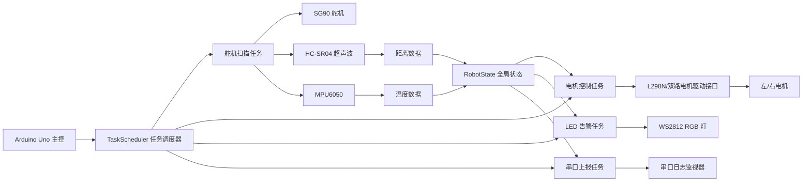
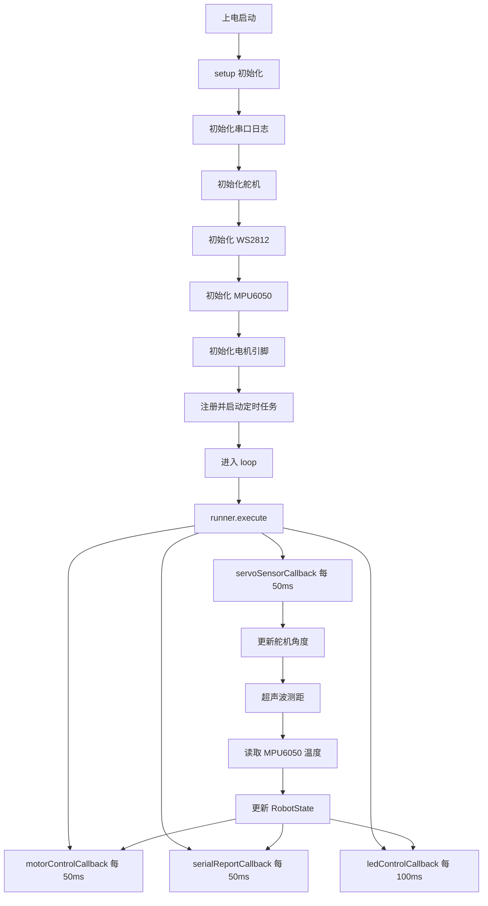

# WALL-E 项目当前实现说明

## 1. 项目概述

这是一个基于 **PlatformIO + Arduino** 的 WALL-E 小车/机器人项目。

当前仓库里一共存在两条实现线：

1. **当前主实现（正在使用）**：`src/main.cpp`
   - 目标板：**Arduino Uno**
   - 功能：舵机扫描、超声波测距、基于距离的电机控制、WS2812 距离告警灯、串口日志输出
2. **预留扩展实现**：`src/esp32_main.cpp`
   - 目标板：**ESP32-CAM**
   - 当前仅完成启动日志，摄像头逻辑尚未接入

此外，`lib/srcv4/` 中保留了 ELEGOO Smart Robot Car V4.0 的一套旧参考代码，但它**不是当前 `src/main.cpp` 这版主程序的核心控制逻辑**。

---

## 2. 当前项目目录说明

```text
.
├── include/
│   └── PinConfig.h          # 当前项目引脚定义
├── src/
│   ├── main.cpp             # Arduino Uno 主程序（当前重点）
│   └── esp32_main.cpp       # ESP32-CAM 预留程序
├── lib/
│   └── srcv4/               # 历史参考代码 / 官方示例改造版本
├── docs/
│   └── 当前项目说明.md       # 本说明文件
└── platformio.ini           # PlatformIO 构建配置
```

---

## 3. 构建目标说明

`platformio.ini` 中配置了两个环境：

- `env:uno`
  - 默认环境
  - 编译 `src/main.cpp`
  - 排除 `src/esp32_main.cpp`
- `env:esp32cam`
  - 编译 `src/esp32_main.cpp`
  - 排除 `src/main.cpp`

也就是说，**当前真正完整可解释的主程序是 Uno 版本**。

---

## 4. 系统总体框图

下面这张图描述的是当前 `src/main.cpp` 的总体结构。



---

## 5. 程序运行流程框图

下面这张图描述系统上电后的执行流程。



---

## 6. 当前硬件连接与职责

根据 `include/PinConfig.h`，当前主程序使用的硬件如下：

| 模块 | 引脚 | 作用 |
|---|---|---|
| HC-SR04 超声波 | Trig=13, Echo=12 | 测量前方障碍物距离 |
| SG90 舵机 | D10 | 带动超声波模块左右扫描 |
| WS2812 | D4 | 用颜色显示当前距离风险 |
| MPU6050 | A4/A5(I2C) | 当前主要用于获取温度，辅助声速修正 |
| 左电机驱动 | EN=5, IN1=6, IN2=7 | 控制左轮速度与方向 |
| 右电机驱动 | EN=3, IN3=2, IN4=8 | 控制右轮速度与方向 |

> 注：`PinConfig.h` 里对电机写了“预留”注释，但从 `src/main.cpp` 来看，电机控制逻辑已经实际启用。

---

## 7. 核心软件结构说明

当前 Uno 主程序的核心是 **“一个共享状态 + 四个周期任务”**。

### 7.1 共享状态 `RobotState`

`RobotState` 用来保存系统运行过程中的公共数据，主要包括：

- 舵机角度、舵机扫描方向
- 超声波回波时间、换算后的距离
- MPU6050 相关字段
- 左右电机的当前速度与方向

这里的设计思想很清晰：

1. 采集任务先更新状态
2. 控制任务和显示任务只读取状态
3. 最终形成一个轻量的“数据驱动控制模型”

这比把所有逻辑都堆在 `loop()` 里更清晰，也更容易扩展。

### 7.2 任务调度器 `TaskScheduler`

程序没有在 `loop()` 里手写大量 `millis()` 判断，而是通过 `TaskScheduler` 注册 4 个周期任务：

- `tServoSensor`：50ms
- `tReport`：50ms
- `tLed`：100ms
- `tMotor`：50ms

`loop()` 中只保留一句：

```cpp
runner.execute();
```

这说明整个系统是一个典型的**协作式定时任务模型**。

---

## 8. 各任务的详细实现讲解

## 8.1 舵机 + 传感器任务：`servoSensorCallback()`

这是整个系统的数据入口。

它做了 3 件事：

1. **控制舵机来回扫描**
   - 初始角度 90°
   - 每次以 10° 步进移动
   - 在 0° 和 180° 之间往返

2. **读取 MPU6050 温度**
   - 调用 `mpu.getEvent(&a, &g, &temp)`
   - 当前代码实际只把 `temp.temperature` 写入 `state.temp`
   - `accelX/gyroX` 等字段目前仍是预留状态，尚未真正写入

3. **执行超声波测距并计算距离**
   - 通过 `sonar.ping()` 获取回波时间（微秒）
   - 根据温度修正声速
   - 再把时间换算为厘米距离

距离换算公式可以理解为：

- 声速会随温度变化
- 超声波往返一次，所以要除以 2
- 最后得到厘米单位距离

这部分的亮点是：**不是直接用固定声速，而是根据 MPU6050 的温度做了一次补偿**，精度比“固定 340m/s”更合理。

---

## 8.2 电机控制任务：`motorControlCallback()`

这个任务负责根据距离决定小车动作。

控制策略分为 3 档：

### 档位 1：危险区 `dist <= 7.5cm`

- 左轮后退
- 右轮前进
- 左右速度都设为 `160`

效果上相当于让小车**原地转向/紧急避让**。

### 档位 2：过渡区 `7.5cm < dist < 75cm`

- 小车继续前进
- 速度根据距离线性映射
- 距离越近，速度越低
- 速度范围：`80 ~ 200`

这是一种比较实用的“接近减速”策略，避免每次都突然停下或猛转。

### 档位 3：安全区 `dist >= 75cm`

- 左右轮全速前进
- 速度设为 `200`

### 特殊情况：测距结果为 0

程序把 `0` 当成“没有读到有效回波”，临时视为 `999cm`，即默认按安全处理。

这意味着：

- 当前实现更偏向“宁可继续走，也不轻易停”
- 如果现场环境回波丢失较多，可能会有误判风险

---

## 8.3 灯光控制任务：`ledControlCallback()`

这个任务根据距离控制 WS2812 的颜色。

颜色规则如下：

- `>= 75cm`：绿色，表示安全
- `<= 7.5cm`：红色，表示危险
- 中间区间：从红 -> 黄 -> 绿平滑渐变

实现方法不是直接手写 RGB 插值，而是借助 **HSV 色彩空间** 进行线性映射，再转换成 RGB。

这样做的好处是：

- 颜色过渡更自然
- 代码更直观
- 更适合做“状态渐变提示”

所以这个灯不只是装饰，而是一个**实时可视化告警界面**。

---

## 8.4 串口上报任务：`serialReportCallback()`

这个任务负责打印运行日志，当前会上报：

- 距离 `D`
- 温度 `T`
- 左右电机速度 `ML / MR`
- 左右方向标志 `FL / FR`

这对于调试非常重要，因为可以直接在串口监视器里观察：

- 测距是否稳定
- 电机控制是否符合预期
- 距离阈值是否需要重新标定

---

## 9. 当前实现的控制逻辑本质

如果用一句话概括当前程序：

> **它是一个基于前方距离感知的简化自主避障小车。**

更具体地说，当前版本已经完成了以下闭环：

1. 舵机带着超声波扫描
2. 获取前方距离
3. 根据距离决定车速和转向
4. 同时用 RGB 灯显示危险程度
5. 用串口持续输出运行状态

这已经形成一个基础的“感知 -> 决策 -> 执行 -> 可视化反馈”的机器人闭环。

---

## 10. 当前版本的特点与局限

### 已实现的优点

- 主程序结构清晰，使用任务调度器而不是阻塞式写法
- 通过共享状态组织数据，便于维护
- 距离、灯光、电机三者已经联动
- 温度补偿使超声波距离计算更合理

### 当前局限

- MPU6050 的加速度/角速度数据字段已定义，但当前主程序尚未真正使用
- 舵机虽然在扫描，但电机控制目前主要还是依据单个最新距离值，没有形成“多方向环境建图”
- 遇到超声波返回 `0` 时，当前策略偏保守不足，默认按“安全”处理
- ESP32-CAM 端尚未接入图像处理或通信逻辑
- `lib/srcv4/` 与当前主程序属于两套思路，仓库中存在一定历史遗留信息

---

## 11. `lib/srcv4` 的定位说明

`lib/srcv4/` 中保留的是另一套较完整的机器人车控制代码，包含：

- 避障
- 跟随
- 循迹
- 红外
- 串口命令
- RGB 表情/灯效

但从当前 `src/main.cpp` 的引用关系来看，这部分更适合理解为：

1. **历史参考实现**
2. **功能备份**
3. **未来迁移时可借鉴的代码来源**

而不是当前运行主链路的一部分。

---

## 12. 如何理解当前项目的开发阶段

当前项目更像是一个 **“新架构重构中的 WALL-E 原型版本”**：

- 已经从老式大 `loop()` 逻辑，迁移到任务调度结构
- 已经分离了 Uno 与 ESP32-CAM 两个目标环境
- 已经搭起了基础自主行驶与告警链路
- 但视觉、姿态融合、多方向避障、远程通信这些高级功能还在后续阶段

因此，当前最准确的定位不是“完整成品”，而是：

> **一个完成了基础感知与运动控制闭环的 WALL-E 机器人底层控制原型。**

---

## 13. 建议的下一步演进方向

如果后续要继续完善，可以优先按下面顺序推进：

1. **补全 MPU6050 数据使用**
   - 真正记录加速度、角速度
   - 做姿态监测、碰撞检测或倾倒保护

2. **把舵机扫描结果做成方向感知**
   - 区分左、中、右方向距离
   - 决策时不只依据“当前一个距离值”

3. **优化测距异常处理**
   - `distance = 0` 时改为谨慎策略
   - 增加多次采样平均/滤波

4. **接入 ESP32-CAM 协同能力**
   - 摄像头视频流
   - 目标识别/巡检
   - 与 Uno 串口或无线通信

5. **整理历史代码与当前代码边界**
   - 将 `lib/srcv4/` 标为 legacy
   - 避免后续维护时混淆

---

## 14. 总结

当前项目的核心并不复杂，但结构已经很有工程化雏形：

- 用 `PlatformIO` 管理多环境构建
- 用 `TaskScheduler` 拆分周期任务
- 用 `RobotState` 组织共享数据
- 用距离驱动电机与灯光反馈

因此，这个项目当前最值得关注的文件是：

- `src/main.cpp`
- `include/PinConfig.h`
- `platformio.ini`

如果你要继续开发，这三个文件就是最核心的入口。